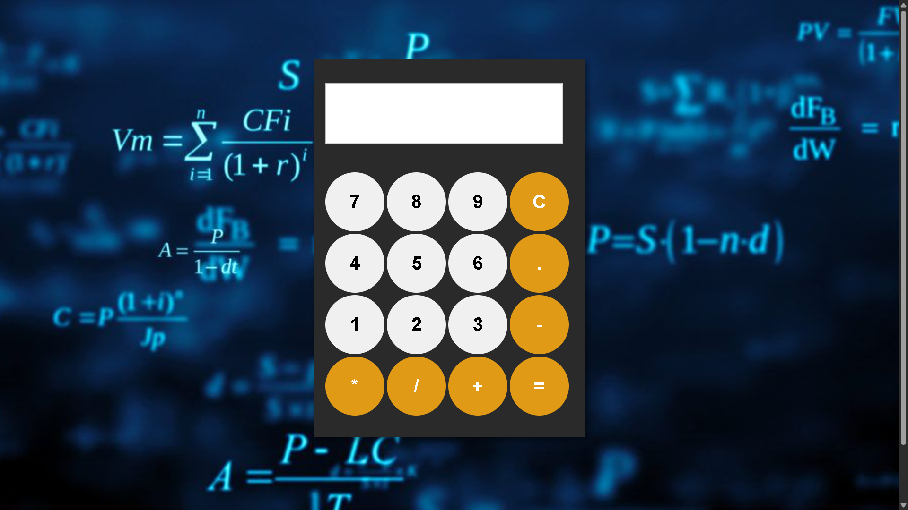

# Calculator
A small calculator with Html/Css and basic Vanilla JS

# Simple Calculator 🧮

A clean and minimal calculator built with HTML, CSS & Vanilla JavaScript.

## Features
- Basic operations: addition, subtraction, multiplication, division
- Clear and delete buttons
- Responsive design

## Built With
- HTML
- CSS
- Vanilla JavaScript

## Preview

